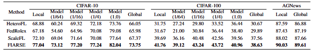
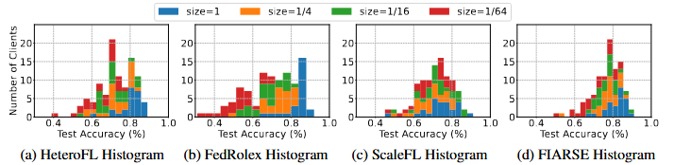
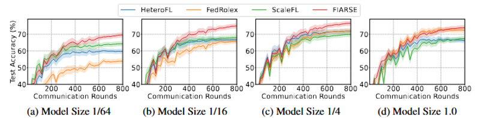
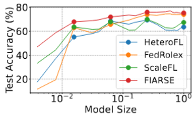

# FIARSE: Model-Heterogeneous Federated Learning via Importance-Aware Submodel Extraction

This repository contains the implementation of the paper **FIARSE: Model-Heterogeneous Federated Learning via Importance-Aware Submodel Extraction**, which is accepted by NeurIPS 2024.

## Requirements
This work is implemented with the following dependencies:
- **PyTorch**: 1.12.1
- **Transformers**: 4.33.1

## Training and Evaluation

Our code is designed to automatically print the evaluation results during training. These results include metrics for both the global test dataset and local test datasets at various training checkpoints. Users do not need to take additional steps for evaluation.


### For CIFAR-10 and CIFAR-100
Navigate to the `fiarse/` directory and execute the following commands depending on varying model sizes:

#### Four Different Model Sizes
```bash
python -u start.py --root ~/dataset --model BetaResNet18_sbn --dataset cifar10 --partitioner balanced --alpha 0.3 --bsz 20 --num-workers 100 --num-part 10 --lr -1 --gpu-idx 0 --K 100 --T 800 --model-size 1.0 0.25 0.0625 0.015625 --model-dist 25 25 25 25
```

#### Five Different Model Sizes
```bash
python -u start.py --root ~/dataset --model BetaResNet18_sbn --dataset cifar10 --partitioner balanced --alpha 0.3 --bsz 20 --num-workers 100 --num-part 10 --lr -1 --gpu-idx 0 --K 100 --T 800 --model-size 1.0 0.64 0.36 0.16 0.04 --model-dist 20 20 20 20 20
```

These commands replicate the four and five model size configurations used in the paper.

#### Layerwise Training for CIFAR-100
To enable layerwise training, use the `fiarse_layerwise/` directory:
```bash
python -u start.py --root ~/dataset --model BetaResNet18_sbn --dataset cifar100 --partitioner balanced --alpha 0.3 --bsz 20 --num-workers 100 --num-part 10 --lr -1 --gpu-idx 0 --K 100 --T 800 --model-size 1.0 0.25 0.0625 0.015625 --model-dist 25 25 25 25
```

### For AGNews
Navigate to the `fiarse_nlp/` directory and execute the following commands:

#### Five Different Model Sizes
```bash
python -u start.py --root ~/dataset --model MaskedRoberta --dataset agnews --partitioner dirichlet --alpha 1.0 --bsz 20 --num-workers 200 --num-part 20 --lr -4 --gpu-idx 0 --K 2 --K-unit epochs --T 300 --model-size 1.0 0.64 0.36 0.16 0.04 --model-dist 40 40 40 40 40
```

#### Four Different Model Sizes
```bash
python -u start.py --root ~/dataset --model MaskedRoberta --dataset agnews --partitioner dirichlet --alpha 1.0 --bsz 20 --num-workers 200 --num-part 20 --lr -4 --gpu-idx 0 --K 2 --K-unit epochs --T 300 --model-size 1.0 0.25 0.0625 0.015625 --model-dist 50 50 50 50
```

## Results

The following table presents the test accuracy under four different submodel sizes. Specifically:
- **Columns from "Local" to "Model (1.0)"** evaluate the test accuracy on the **local test datasets** for each submodel size.
- **"Global"** evaluates the average test accuracy of the global model of four different sizes (1/64, 1/16, 1/4, 1/0) on the **global test dataset**.



### Additional Results on CIFAR-10 with Four Model Sizes (1/64, 1/16, 1/4, 1/0)

1. **Histograms of Test Accuracy Across Clients**: The histograms below show the distribution of clients achieving various levels of test accuracy for different submodel extraction methods under the four model sizes.\
   

2. **Comparison of Test Accuracy Across Communication Rounds**: This plot illustrates the test accuracy trends on the **global test datasets** for CIFAR-10 across communication rounds under varying submodel sizes (1/64, 1/16, 1/4, 1/0) for different submodel extraction strategies.\
   

3. **Comparison Across Submodel Sizes**: The following figure highlights the comparison of test accuracy on the **global test dataset** across different submodel sizes for varying submodel extraction methods.\
   

For more comprehensive results and analyses, please refer to our paper.


## Citation
If you use this work in your research, please cite our paper:
```bibtex
@inproceedings{wu2024fiarse,
  title={FIARSE: Model-Heterogeneous Federated Learning via Importance-Aware Submodel Extraction},
  author={Wu, Feijie and Wang, Xingchen and Wang, Yaqing and Liu, Tianci and Su, Lu and Gao, Jing},
  booktitle={Proc. of Advances in Neural Information Processing Systems (NeurIPS'24)},
  year={2024}
}
```